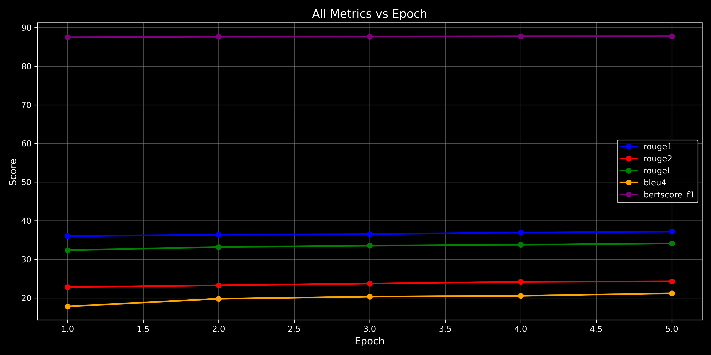
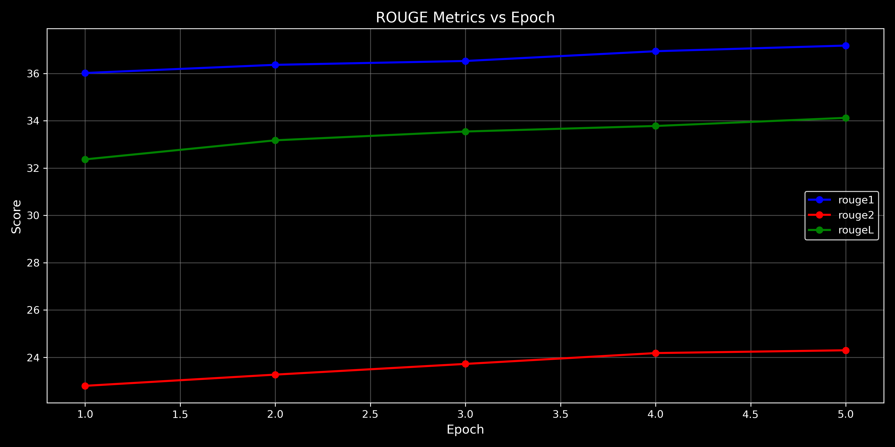
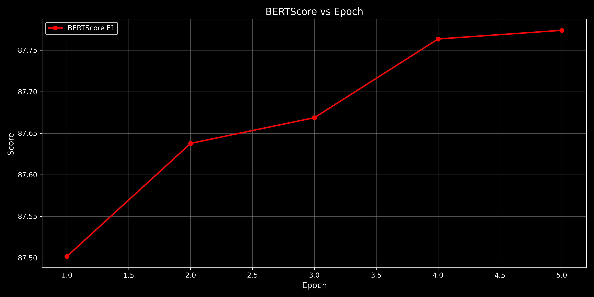
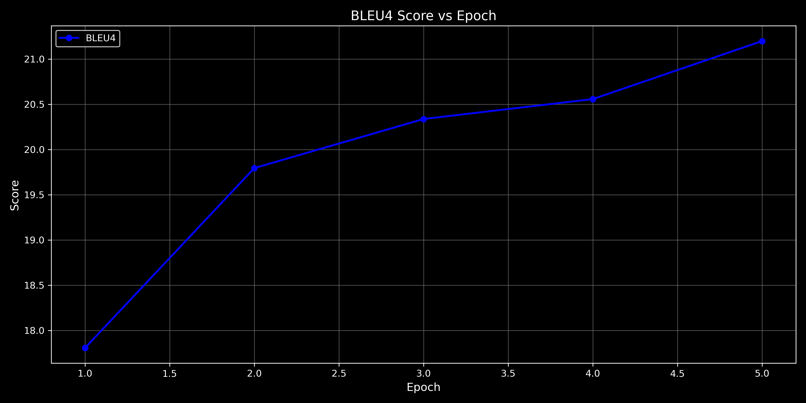
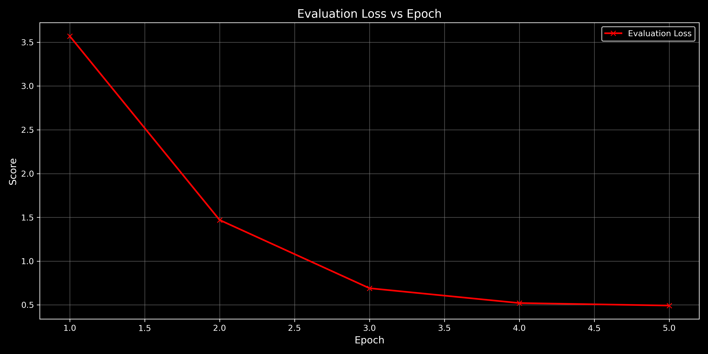

# preprocessing

The preprocessing pipeline ensures that the input data is clean and ready for training. The following steps are applied:

Expanding Contractions:

Common contractions (e.g., "can't" → "cannot") are expanded using a predefined dictionary (contractions_dict).
Cleaning Text:

URLs, special characters, and numbers are removed.
Text is converted to lowercase.
Extra whitespace is stripped.
Tokenization:

Input sequences (Social Media Post) are prefixed with "normalize claim: " for T5 models.
Both input and target sequences are tokenized using the respective model's tokenizer.

# hyperparams

2. Model Architecture and Hyperparameters
Models Used:
BART: facebook/bart-base
A transformer-based encoder-decoder model pre-trained for text generation tasks.
T5: t5-small
A transformer-based model designed for text-to-text tasks.
Hyperparameters:
Max Source Length: 512
Max Target Length: 128
Batch Size: 16 (adjusted for GPU memory constraints)
Gradient Accumulation Steps: 4
Learning Rate: 5e-5
Weight Decay: 0.01
Epochs: 3
Beam Search: 4 beams for generation
Mixed Precision: Enabled if CUDA is available

# plots

- Training and Validation Loss Plots T5

Training Process:
Both models were trained using the Hugging Face Seq2SeqTrainer.
Training and validation loss were logged at the end of each epoch.
Loss Plots:
The following plots illustrate the training and validation loss for both models:






- BART:

Training Loss: Decreases steadily over epochs.
Validation Loss: Slightly higher than training loss, indicating minimal overfitting.
T5:
Training Loss: Higher than BART due to the smaller model size.
Validation Loss: Similar trend to BART but with slightly higher values.







# training:

T5 model
```
epoch,eval_loss,eval_rouge1,eval_rouge2,eval_rougeL,eval_bleu4,eval_bertscore_f1,train_loss
1.00,5.0902,21.6912,12.1577,19.3221,7.3569,82.6977,
2.00,1.6329,24.0021,14.7177,21.2353,9.1074,84.5683,
3,1.2384,15.2168,7.1711,13.2521,4.8643,82.9002,6.0718
test,1.4422,26.8126,16.5515,23.4878,9.3488,84.9818,
```

BART model
```
epoch,eval_loss,eval_rouge1,eval_rouge2,eval_rougeL,eval_bleu4,eval_bertscore_f1,eval_runtime,eval_samples_per_second,eval_steps_per_second
1.0,3.5704,36.0186,22.7969,32.3677,17.8084,87.5019,77.5104,5.444,0.348
2.0,1.4702,36.3633,23.2706,33.1735,19.7956,87.6379,52.0755,8.104,0.518
3.0,0.6909,36.5259,23.7231,33.5452,20.3379,87.6688,53.3778,7.906,0.506
4.0,0.5216,36.9383,24.1812,33.7791,20.5581,87.7635,49.7551,8.482,0.543
5.0,0.4929,37.1771,24.2994,34.1230,21.1992,87.7739,45.6702,9.240,0.591
bart-test,3.6173,37.5218,24.9321,34.5256,18.5341,87.5642,
```
# evaluation metric

The models were evaluated on the test dataset using the following metrics:

ROUGE:

Measures overlap between generated and reference text.
Scores: ROUGE-1, ROUGE-2, ROUGE-L.
BLEU-4:

Measures n-gram overlap between generated and reference text.
BERTScore:

Uses BERT embeddings to compute semantic similarity between generated and reference text.

# analysis

5. Comparative Analysis
Performance:
BART outperforms T5 across all metrics due to its larger model size and pre-training on summarization tasks.
T5 performs reasonably well given its smaller size, making it suitable for resource-constrained environments.
Resource Constraints:
BART requires more GPU memory and training time.
T5 is faster and more memory-efficient, making it a better choice for limited hardware.

# discussion

6. Discussion on Resource Constraints
Challenges:
Limited GPU memory required reducing batch size and using gradient accumulation.
Training time was a bottleneck for larger models like facebook/bart-large.
Solutions:
Used smaller variants of BART (facebook/bart-base) and T5 (t5-small).
Enabled mixed precision training (fp16) to reduce memory usage.